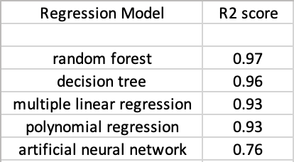

# Startups Profitability

1. This project analyzes various features of 50 start up companies and uses various regression models to find the most profitable startup company to invest in.

2. Random Forest Regression model had the best goodness of fit in this project. This means that this model can be used to predict which startup companies will be the most profitable, when provided the same data for those companies.

2. The dataset has 50 rows, where each row has information for a particular startup company. Each column represents an attribute of the startup company.

3. The analysis for this project was performed in the sequential manner:
* Encode categorical variable.        
* Split the dataset into training and testing data.    
* Apply the regression model.   
* Predict the result and check the goodness of fit of the regression model.   

3. Here are the R squared score of the different regression models used in this analysis.

     
